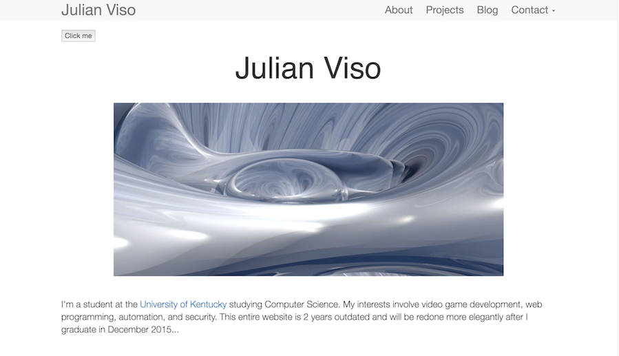

In the past four months, everything in my life has changed drastically. I graduated college, started working as a software engineer, and for the first time in several years have found myself with plenty of free time. For over half a year I've had the intention of remodeling my site, but found an excuse to put it off. Given the recent changes in my life, I figured now is the perfect time to do some spring cleaning and bring back life to this site. Today you're seeing that in this new layout.
  
You may remember my old site. It was my first time creating any website. My lack of creativity however, and limited knowledge led to a rather empty looking website however:

>I did however experiment a lot with it, although from a viewing standpoint it was an extremely boring site...

So what's new?

-For the first time I'll be using Jekyll on this site.

-The blog page will include blogs for the first time!

-There will no longer be an About page. Instead I will be including my resume.

